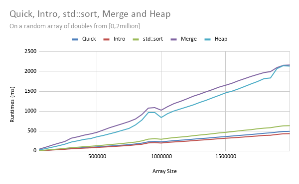

# Introsort-Analysis

## Goal:

The goal of this project is to create an implementation of Introsort that is comparable in runtimes to the C++ STL std::sort(). It is important to note that std::sort() is also implemented with Introsort, though it is probably heavily optimized.

[See Results](#Results)

## What is Introsort?

Invented by David R. Musser, Introsort is a hybrid sorting algorithm that runs Quicksort until the number of recursive quicksort calls reaches 2log2n. At this point Introsort switches to Heap sort. When Introsort is working on subarrays with size less than a certain threshold it will further switch to Insertion sort.

David R. Musser determined that the this threshold should be 16. That is to say, Introsort will switch to Insertion sort on subarrays of size 16.

[Source](http://ace.cs.ohio.edu/~razvan/courses/cs4040/introsort.pdf)

## Testing Methodology

Testing was carried out by running various sorting algorithms on a double array of size 50,000 twenty-times and taking the average of the runtimes. This process was carried out on increasing sized arrays up to 2,000,000 increasing the size of the array by 50,000 each time.

The following arrays are tested: randomized, sorted, reverse order, and single number.

The following algorithms were tested: Quicksort, Heap sort, Merge sort, Introsort, and std::sort()

## Analysis of Data

The results of the tests are saved in a file called `data.csv` and a python script will then convert `data.csv` into an excel spreadsheet titled `output.xlsx`. Then I constructed a line-graph out of that spreadsheet.

## Challenges Faced

- Most online implementations ([geeksforgeeks](https://www.geeksforgeeks.org/introsort-or-introspective-sort/)) of Introsort suggest immediately running Insertion sort on small subarrays
  - This causes the performance of Introsort to be very slow as the Heap sort and Quick sort portions of the sorting algorithm become held up. Testing was stopped at 500,000 for the sake of time.
  - In actuality, Musser suggests leaving the small subarrays to be unsorted and then to run one final pass of Insertion sort at the end. This results in significant improvements.

- Choosing the pivot was initially done with the naïve method (choosing the last element) which was later changed to the median-of-3 method that selects the median of the first, middle, and last element as the pivot.
  - This works well for every type of array except for arrays with a single number. As a result, I am considering implementing a partition method that utilizes a 3-way partition algorithm along with median-of-3. Initial tests suggest that this does significantly improve runtimes on a single number array but also suggest in slower runtimes for every other array.

## Results

On a sorted and randomized array, my implementation of Introsort outperforms (albeit slightly) std::sort() and Quick sort.

**Random:**

**Sorted:**

However, on a reverse sorted and single number array, my implementation of Introsort suffers.

**Reverse:**

**Constant:** 

